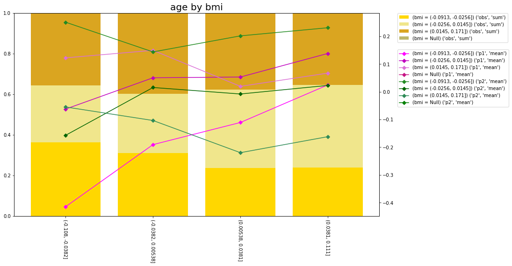

# (Super simple) Summarisation and Plotting


[](https://mybinder.org/v2/gh/richardangell/sumnplot/HEAD?labpath=demo)

## Introduction

``sumplot`` provides some very simple functionality to discretise, summarise and plot variables.

The example below uses the [diabetes](https://scikit-learn.org/stable/modules/generated/sklearn.datasets.load_diabetes.html) data and will summarise the variables `s1`, `s2` and `s3` by `age` and `bmi` which are both discretised according to specific quantiles. 

```python
from sklearn.datasets import load_diabetes
from sumnplot.discretisation import QuantileDiscretiser
from sumnplot.summary import ColumnSummariser
from sumnplot.plot.matplotlib import plot_summarised_variable_2way
```

```python
X, y = load_diabetes(return_X_y=True, as_frame=True)
```

```python
two_way_summary = ColumnSummariser._summarise_column(
    df=X,
    to_summarise_columns=["s1", "s2", "s3"],
    to_summarise_columns_labels=["obs", "p1", "p2"],
    to_summarise_divide_column="s1",
    by_column=sp.discretisation.QuantileDiscretiser(
        variable="age", quantiles=(0, 0.25, 0.5, 0.75, 1.0)
    ),
    second_by_column=sp.discretisation.QuantileDiscretiser(
        variable="bmi", quantiles=(0, 0.33, 0.66, 1.0)
    ),
)
```

```python
plot_summarised_variable_2way(
    two_way_summary,
    axis_right=0,
    axis_left=[1, 2],
    bar_type="stacked",
    bars_percent=True,
)
```


[](https://github.com/richardangell/sumnplot/blob/main/demo/Plotting.ipynb)

## Install

The easiest way to get `sumnplot` is directly from [pypi](https://pypi.org/project/sumnplot/) using;

```
pip install sumnplot
```

## Documentation

Documentation can be found at [readthedocs](https://sumnplot.readthedocs.io/en/latest/).

For information on how to build the documentation locally see the docs [README](https://github.com/richardangell/sumnplot/tree/master/docs).

## Examples

There are various example notebooks demonstrating how to use the package in the [demo](https://github.com/richardangell/sumnplot/tree/master/demo) folder in the repo.

To open the example notebooks in [binder](https://mybinder.org/) click [here](https://mybinder.org/v2/gh/richardangell/sumnplot/HEAD?labpath=demo) or click on the `launch binder` shield above and then click on the directory button in the side bar to the left to navigate to the specific notebook.

## Build

`sumnplot` uses [flit](https://flit.readthedocs.io/en/latest/index.html) as the package build tool. 

To install `sumnplot` for development, use the following commands from the root directory;

```
pip install "flit>=3.2,<4"
flit install
```

The default `deps` flag for `flit` is `all` so this will install all of the libraries required for testing and creating the docs.

To install `sumnplot` in editable mode (i.e. the equivalent of `pip install . -e`) use the `symlink` flag;

```
flit install --symlink
```

See the [flit docs](https://flit.readthedocs.io/en/latest/cmdline.html#) for all the command line options for `flit`.

