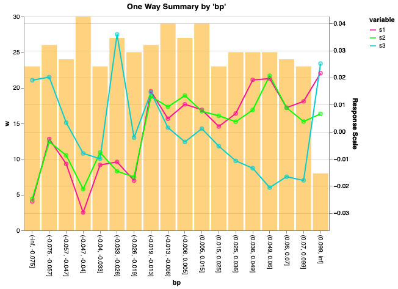

# (Super simple) Summarisation and Plotting


## Introduction

``sumplot`` provides some very simple functionality to discretise, summarise and plot data.

The example below uses the [diabetes](https://scikit-learn.org/stable/modules/generated/sklearn.datasets.load_diabetes.html) dataset and summarises the variables `s1`, `s2` and `s3` by `bp`. The `bp` variable is discretised into buckets with a minimum of 5% of weight per bucket.

```python
import polars as pl
from sklearn.datasets import load_diabetes

from sumnplot.discretisation import EqualWeightDiscretiser
from sumnplot.summarisation import group_by_weighted_average, ResponseWeight
from sumnplot.plot.altair.one_way_summary import produce_one_way_summary_plot

X, _ = load_diabetes(return_X_y=True, as_frame=True)
df = pl.DataFrame(X).with_columns(pl.lit(1).alias("w"))

bp_discretiser = EqualWeightDiscretiser(
    column="bp",
    weights="w",
    min_weight_proportion=0.05,
    round_breaks_for_labels=True,
)
bp_discretiser.fit(df)
df = bp_discretiser.transform(df)

results = group_by_weighted_average(
    df,
    groupby_columns=["bp"],
    responses=[ResponseWeight("s1", "w"), ResponseWeight("s2", "w"), ResponseWeight("s3", "w")],
)

chart = produce_one_way_summary_plot(
    results,
    x_axis_column="bp",
    left_y_axis_column="w",
    right_y_axis_columns=["s1", "s2", "s3"],
    title="One Way Summary by 'bp'",
    x_axis_label_angle=90,
)
```



## Install

The easiest way to get `sumnplot` is directly from [pypi](https://pypi.org/project/sumnplot/) using:

```
pip install sumnplot
```

## Documentation

Documentation can be found at [readthedocs](https://sumnplot.readthedocs.io/en/latest/).

For information on how to build the documentation locally see the docs [README](https://github.com/richardangell/sumnplot/tree/master/docs).

## Build

`sumnplot` uses [uv](https://docs.astral.sh/uv/) as the project management tool. 

To install `sumnplot` for development, first [install uv](https://docs.astral.sh/uv/getting-started/installation/) then run the following from the project root:

```
uv sync
```
